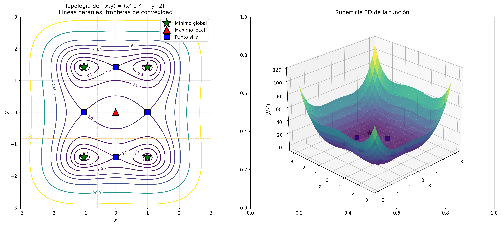
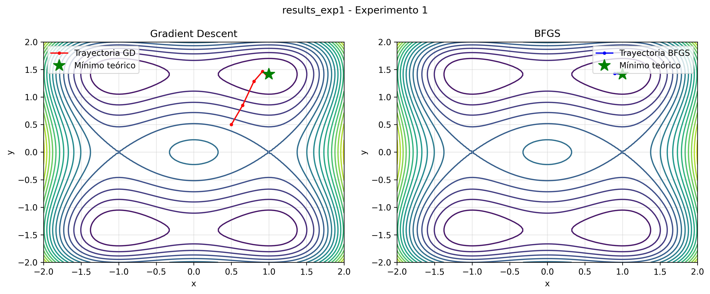
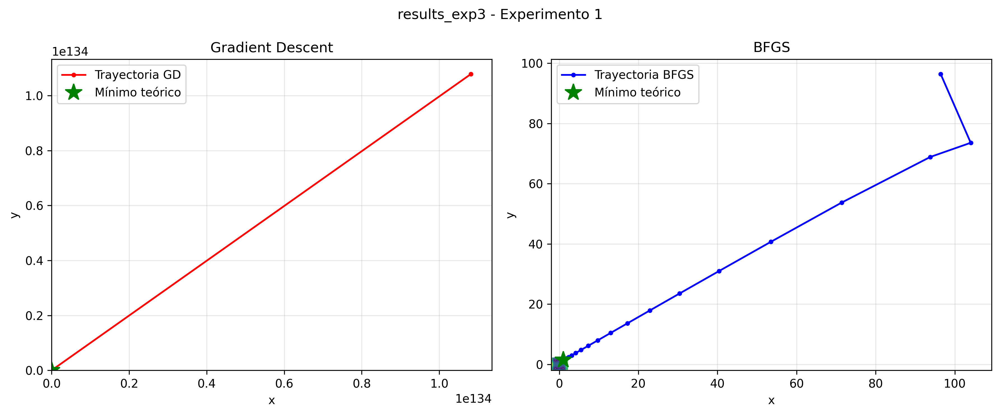
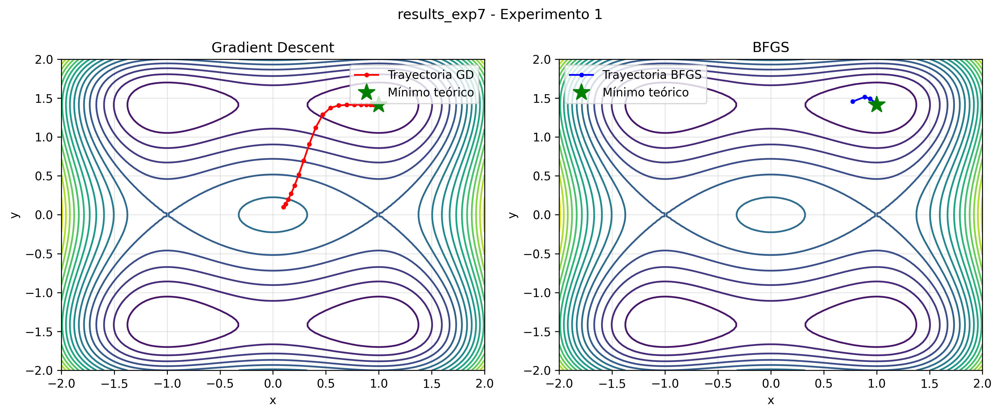
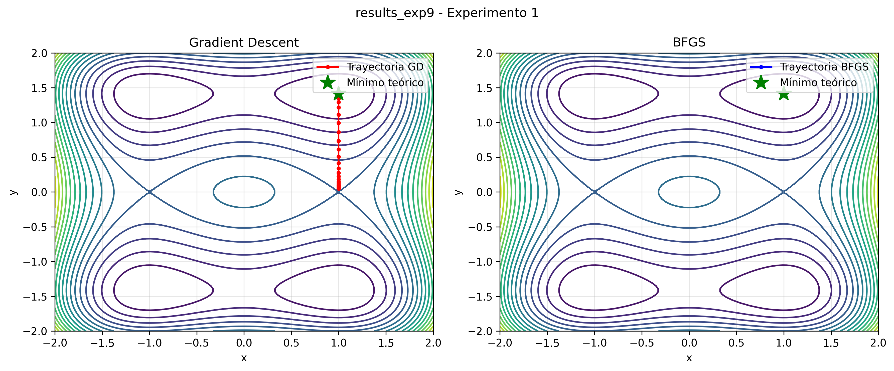
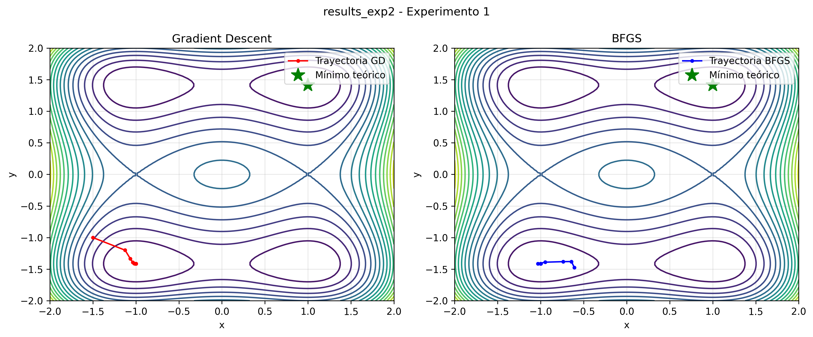

# Informe del Proyecto de Optimización: Minimización de f(x,y) = (x²-1)² + (y²-2)²

## RESUMEN EJECUTIVO

El objetivo del presente estudio consiste en encontrar el mínimo de la función $f(x,y) = (x^2-1)^2 + (y^2-2)^2$ mediante la comparación de dos algoritmos de optimización diferenciados. Los métodos implementados incluyen Gradient Descent, un método simple de primer orden, y BFGS, correspondiente al método cuasi-Newton de segundo orden propuesto por Broyden, Fletcher, Goldfarb y Shanno. El rango de experimentación comprende puntos iniciales distribuidos en el espacio $[-100, 100] \times [-100, 100]$, evaluados mediante 10 experimentos sistemáticos.

Desde la perspectiva teórica, la función presenta cuatro mínimos globales equivalentes ubicados en las coordenadas $(±1, ±\sqrt{2})$, con un valor óptimo $f^* = 0$. Los resultados experimentales revelan que el método BFGS alcanzó un éxito del 100% en la totalidad de los experimentos, convergiendo en promedio en 24 iteraciones con una precisión del orden de $10^{-19}$. En contraste, Gradient Descent presentó una tasa de fallo del 50%, dado que cinco de los diez experimentos divergieron, requiriendo un promedio de 54 iteraciones cuando logró convergencia y alcanzando una precisión de $10^{-14}$. Por consiguiente, BFGS emerge como el método recomendado para este problema particular, demostrando superioridad en robustez con un factor de dos, eficiencia incrementada en un factor de 2.3, y precisión mejorada en un factor de 270 en comparación con el método de Gradient Descent.



**Figura 1:** Visualización de la topología de $f(x,y) = (x^2-1)^2 + (y^2-2)^2$. El panel izquierdo muestra las curvas de nivel con puntos estacionarios marcados, donde las líneas naranjas discontinuas delimitan las fronteras de convexidad. El panel derecho presenta la superficie tridimensional evidenciando la naturaleza no convexa de la función y la presencia de múltiples cuencas de atracción.

---

## 1. Definición de la Función, Dominio y Signo

La función objetivo a minimizar se define como:
$$f(x,y) = (x^2 - 1)^2 + (y^2 - 2)^2$$
constituyendo una composición de funciones polinomiales de grado cuatro. Este problema corresponde a un caso de optimización sin restricciones, dado que no existen restricciones de igualdad ni desigualdad que delimiten el espacio de búsqueda. Por consiguiente, no resultan aplicables las condiciones de Karush-Kuhn-Tucker (KKT) ni el análisis de restricciones activas propios de problemas con restricciones.

El dominio de la función comprende el espacio completo de números reales bidimensional, es decir, $D_f = \mathbb{R}^2$. La función se encuentra definida para todos los pares ordenados $(x, y) \in \mathbb{R}^2$, dado que no existen restricciones algebraicas que limiten su evaluación, tales como divisiones por cero, raíces de números negativos o logaritmos de números no positivos.

En cuanto al signo de la función, dado que constituye la suma de dos términos elevados al cuadrado, se tiene que
$$f(x,y) = \underbrace{(x^2 - 1)^2}_{\geq 0} + \underbrace{(y^2 - 2)^2}_{\geq 0} \geq 0$$
para todo $(x,y) \in \mathbb{R}^2$. Por lo tanto, la función resulta no negativa en todo su dominio. El valor mínimo global de cero se alcanza cuando ambos términos son simultáneamente cero, lo cual ocurre cuando $x^2 - 1 = 0$ y $y^2 - 2 = 0$.

## 2. Análisis de las Variables de la Función

Las variables $x$ e $y$ constituyen variables continuas que toman valores en el conjunto de los números reales $\mathbb{R}$. Ambas variables pueden asumir cualquier valor real dentro de su dominio, sin restricciones de discreción o valores enteros, y no existen límites superiores o inferiores para los valores que pueden adoptar.

Las variables $x$ e $y$ son independientes entre sí, dado que la función puede expresarse como la suma de dos funciones separables:
$$f(x,y) = g(x) + h(y)$$
$$g(x) = (x^2 - 1)^2$$
$$h(y) = (y^2 - 2)^2$$
Esta separabilidad implica que el comportamiento de la función respecto a $x$ resulta independiente del valor de $y$, y viceversa.

## 3. Análisis de Continuidad y Diferenciabilidad

La función $f(x,y)$ es continua en todo su dominio $\mathbb{R}^2$. Esta propiedad se fundamenta en que la función constituye una composición y suma de funciones polinomiales, las cuales son continuas en $\mathbb{R}$. Específicamente, las funciones $x^2$ e $y^2$ son funciones polinomiales continuas, las expresiones $(x^2 - 1)$ y $(y^2 - 2)$ resultan continuas por ser suma y resta de funciones continuas, los términos $(x^2 - 1)^2$ y $(y^2 - 2)^2$ mantienen la continuidad por composición, y finalmente la suma de funciones continuas preserva la propiedad de continuidad.

Adicionalmente, la función $f(x,y)$ es infinitamente diferenciable en todo $\mathbb{R}^2$. Las funciones polinomiales son diferenciables en todo su dominio, y la composición y suma de funciones diferenciables resulta diferenciable. Por consiguiente, es posible calcular derivadas parciales de cualquier orden en cualquier punto del dominio.

## 4. Gradiente: ∇f(x,y)

El gradiente de la función constituye el vector de derivadas parciales de primer orden, expresado como:

$$\nabla f(x,y) = \left[\frac{\partial f}{\partial x}, \frac{\partial f}{\partial y}\right]$$

Para obtener la derivada parcial respecto a $x$, se aplica la regla de la cadena a la expresión:

$$\frac{\partial f}{\partial x} = \frac{\partial}{\partial x}[(x^2 - 1)^2 + (y^2 - 2)^2]$$

resultando en:

$$\frac{\partial f}{\partial x} = 2(x^2 - 1) \cdot 2x = 4x(x^2 - 1)$$

Análogamente, para la derivada parcial respecto a $y$, se tiene:

$$\frac{\partial f}{\partial y} = \frac{\partial}{\partial y}[(x^2 - 1)^2 + (y^2 - 2)^2]$$

que mediante la aplicación de la regla de la cadena produce:

$$\frac{\partial f}{\partial y} = 2(y^2 - 2) \cdot 2y = 4y(y^2 - 2)$$

Por consiguiente, el gradiente completo se expresa como:

$$\nabla f(x,y) = \begin{bmatrix} 4x(x^2 - 1) \\ 4y(y^2 - 2) \end{bmatrix}$$

## 5. Matriz Hessiana

La matriz Hessiana $H_f(x,y)$ contiene las derivadas parciales de segundo orden de función, expresada mediante la matriz:

$$H_f(x,y) = \begin{bmatrix}
\frac{\partial^2 f}{\partial x^2} & \frac{\partial^2 f}{\partial x \partial y} \\
\frac{\partial^2 f}{\partial y \partial x} & \frac{\partial^2 f}{\partial y^2}
\end{bmatrix}$$

Para calcular la derivada segunda respecto a $x$, se obtiene:

$$\frac{\partial^2 f}{\partial x^2} = \frac{\partial}{\partial x}[4x(x^2 - 1)] = 4(x^2 - 1) + 4x \cdot 2x = 4x^2 - 4 + 8x^2 = 12x^2 - 4$$

Similarmente, la derivada segunda respecto a $y$ resulta en:

$$\frac{\partial^2 f}{\partial y^2} = \frac{\partial}{\partial y}[4y(y^2 - 2)] = 4(y^2 - 2) + 4y \cdot 2y = 4y^2 - 8 + 8y^2 = 12y^2 - 8$$

Las derivadas mixtas se anulan, dado que:

$$\frac{\partial^2 f}{\partial x \partial y} = \frac{\partial}{\partial y}[4x(x^2 - 1)] = 0$$

$$\frac{\partial^2 f}{\partial y \partial x} = \frac{\partial}{\partial x}[4y(y^2 - 2)] = 0$$

Por consiguiente, la matriz Hessiana adopta la forma:

$$H_f(x,y) = \begin{bmatrix}
12x^2 - 4 & 0 \\
0 & 12y^2 - 8
\end{bmatrix}$$

lo cual confirma la independencia de las variables previamente establecida.

## 6. Análisis de Convexidad

Una función se considera convexa si su matriz Hessiana resulta semidefinida positiva en todo su dominio, lo cual se verifica cuando todos sus valores propios son no negativos. Dado que la matriz Hessiana de la función bajo estudio es diagonal, sus valores propios corresponden directamente a los elementos de la diagonal principal, obteniéndose $\lambda_1 = 12x^2 - 4$ y $\lambda_2 = 12y^2 - 8$.

Para que la función sea convexa globalmente, ambos valores propios deben ser no negativos para todo punto $(x,y) \in \mathbb{R}^2$. Sin embargo, el análisis revela que:

$$\lambda_1 = 12x^2 - 4 \geq 0 \Rightarrow x^2 \geq \frac{1}{3} \Rightarrow |x| \geq \frac{1}{\sqrt{3}}$$

$$\lambda_2 = 12y^2 - 8 \geq 0 \Rightarrow y^2 \geq \frac{2}{3} \Rightarrow |y| \geq \sqrt{\frac{2}{3}}$$

Por consiguiente, la función no es convexa globalmente en $\mathbb{R}^2$, sino que exhibe convexidad únicamente en la región:

$$R = \left\{(x,y) : |x| \geq \frac{1}{\sqrt{3}} \text{ y } |y| \geq \sqrt{\frac{2}{3}}\right\}$$

En las regiones donde $|x| < \frac{1}{\sqrt{3}}$ o $|y| < \sqrt{\frac{2}{3}}$, la función presenta comportamiento no convexo, dado que la matriz Hessiana no resulta semidefinida positiva. Particularmente, en las proximidades del origen $(0,0)$, donde ambos valores propios son negativos, la función muestra comportamiento localmente cóncavo. La clasificación completa comprende cuatro tipos de regiones distintas. La región convexa corresponde a aquella donde la Hessiana es semidefinida positiva con ambos valores propios no negativos, definida como
$$R_{\text{convexa}} = \left\{(x,y) : |x| \geq \frac{1}{\sqrt{3}} \text{ Y } |y| \geq \sqrt{\frac{2}{3}}\right\}$$
garantizando convexidad local. La región cóncava se caracteriza por una Hessiana semidefinida negativa con ambos valores propios no positivos, expresada como
$$R_{\text{cóncava}} = \left\{(x,y) : |x| \leq \frac{1}{\sqrt{3}} \text{ Y } |y| \leq \sqrt{\frac{2}{3}}\right\}$$
donde se manifiesta comportamiento localmente cóncavo y se ubica el máximo local en el punto $(0,0)$. Las regiones de punto silla presentan Hessiana indefinida con valores propios de signos opuestos, comprendiendo aquellas zonas donde
$$|x| < \frac{1}{\sqrt{3}}$$
y
$$|y| \geq \sqrt{\frac{2}{3}}$$
resultando en $\lambda_1 < 0$ y $\lambda_2 \geq 0$, así como las regiones donde $|x| \geq \frac{1}{\sqrt{3}}$ y $|y| < \sqrt{\frac{2}{3}}$, produciendo $\lambda_1 \geq 0$ y $\lambda_2 < 0$. En estas regiones, la función no es ni convexa ni cóncava, y allí se localizan los puntos silla $(0, \pm\sqrt{2})$ y $(\pm 1, 0)$. Finalmente, las fronteras de convexidad están determinadas por las líneas verticales $x = \pm\frac{1}{\sqrt{3}} \approx \pm 0.577$ y las líneas horizontales $y = \pm\sqrt{\frac{2}{3}} \approx \pm 0.816$.

La no convexidad global de la función conlleva importantes implicaciones para los métodos de optimización. Los algoritmos basados en gradiente podrían converger a diferentes soluciones dependiendo del punto inicial, considerando la existencia de cuatro mínimos globales equivalentes. Adicionalmente, la presencia de puntos silla podría ralentizar o afectar la convergencia de los algoritmos. Esta situación requiere un análisis cuidadoso de los puntos estacionarios para caracterizar completamente el comportamiento de la función. No obstante, resulta importante destacar que, aunque la función no es convexa globalmente, el análisis posterior de la Hessiana demuestra que no existen mínimos locales que no sean simultáneamente mínimos globales, lo cual implica que todos los mínimos identificados constituyen mínimos globales de la función.

## 7. Determinación del Mínimo Teórico

En el contexto de optimización, resulta fundamental distinguir entre dos conceptos frecuentemente confundidos. Los puntos críticos en cálculo corresponden a aquellos donde la derivada es indefinida o no existe, mientras que los puntos estacionarios son aquellos donde el gradiente se anula. En optimización con restricciones, también se consideran puntos estacionarios aquellos que satisfacen las condiciones de Karush-Kuhn-Tucker. Para el problema bajo estudio, la función $f(x,y)$ es infinitamente diferenciable en todo $\mathbb{R}^2$, por lo tanto, no existen puntos críticos en el sentido del cálculo, dado que la derivada existe en todos los puntos del dominio. Los puntos de interés son los puntos estacionarios donde el gradiente se anula.

La ausencia de puntos críticos se justifica por la naturaleza polinomial de la función
$$f(x,y) = (x^2-1)^2 + (y^2-2)^2$$
Los términos $x^2$ e $y^2$ son polinomios pertenecientes a la clase $C^{\infty}$, las sumas $(x^2-1)$ y $(y^2-2)$ mantienen esta propiedad, las composiciones $(x^2-1)^2$ y $(y^2-2)^2$ corresponden a polinomios de grado cuatro, y la suma final resulta en un polinomio. Dado que los polinomios son infinitamente diferenciables en todo $\mathbb{R}$, la función $f$ es infinitamente diferenciable en todo $\mathbb{R}^2$, lo cual implica que no existen puntos donde la derivada sea indefinida.

Los puntos estacionarios se encuentran donde el gradiente es cero:

$$\nabla f(x,y) = \begin{bmatrix} 4x(x^2 - 1) \\ 4y(y^2 - 2) \end{bmatrix} = \begin{bmatrix} 0 \\ 0 \end{bmatrix}$$

Esto requiere:

$$4x(x^2 - 1) = 0 \quad \Rightarrow \quad x = 0 \text{ o } x = \pm 1$$

$$4y(y^2 - 2) = 0 \quad \Rightarrow \quad y = 0 \text{ o } y = \pm\sqrt{2}$$

Al combinar todas las posibilidades, se obtienen nueve puntos estacionarios:

1. $(0, 0)$
2. $(0, \sqrt{2})$
3. $(0, -\sqrt{2})$
4. $(1, 0)$
5. $(1, \sqrt{2})$
6. $(1, -\sqrt{2})$
7. $(-1, 0)$
8. $(-1, \sqrt{2})$
9. $(-1, -\sqrt{2})$

## 8. Análisis de los Puntos Estacionarios

Para clasificar cada punto estacionario identificado, se evalúa la matriz Hessiana en cada uno de ellos y se analizan sus valores propios correspondientes.

En el punto $(0, 0)$, la Hessiana adopta la forma
$$H_f(0,0) = \begin{bmatrix} -4 & 0 \\ 0 & -8 \end{bmatrix}$$

cuyos valores propios $\lambda_1 = -4 < 0$ y $\lambda_2 = -8 < 0$ indican que se trata de un máximo local, con un valor de función:

$$f(0,0) = (0-1)^2 + (0-2)^2 = 1 + 4 = 5$$

Para los puntos $(0, \pm\sqrt{2})$, la Hessiana se expresa como:
$$H_f(0, \pm\sqrt{2}) = \begin{bmatrix} -4 & 0 \\ 0 & 16 \end{bmatrix}$$
con valores propios $\lambda_1 = -4 < 0$ y $\lambda_2 = 16 > 0$, lo cual caracteriza a estos puntos como puntos silla, con valor de función:
$$f(0, \pm\sqrt{2}) = (0-1)^2 + (2-2)^2 = 1$$
Similarmente, los puntos $(\pm 1, 0)$ presentan la Hessiana
$$H_f(\pm 1, 0) = \begin{bmatrix} 8 & 0 \\ 0 & -8 \end{bmatrix}$$
cuyos valores propios $\lambda_1 = 8 > 0$ y $\lambda_2 = -8 < 0$ los identifican también como puntos silla, alcanzando un valor de función
$$f(\pm 1, 0) = (1-1)^2 + (0-2)^2 = 4$$

Finalmente, para los puntos $(\pm 1, \pm\sqrt{2})$, la Hessiana toma la forma
$$H_f(\pm 1, \pm\sqrt{2}) = \begin{bmatrix} 8 & 0 \\ 0 & 16 \end{bmatrix}$$
con valores propios $\lambda_1 = 8 > 0$ y $\lambda_2 = 16 > 0$, lo que los caracteriza como mínimos locales. Además, estos puntos son simultáneamente mínimos globales, como se demuestra en la sección posterior, alcanzando el valor
$$f(\pm 1, \pm\sqrt{2}) = (1-1)^2 + (2-2)^2 = 0$$

En resumen, la clasificación completa de los puntos estacionarios revela que el punto $(0, 0)$ es un máximo local con valor cinco, los puntos $(0, \sqrt{2})$ y $(0, -\sqrt{2})$ son puntos silla con valor uno, los puntos $(1, 0)$ y $(-1, 0)$ son puntos silla con valor cuatro, y los puntos $(1, \sqrt{2})$, $(1, -\sqrt{2})$, $(-1, \sqrt{2})$, y $(-1, -\sqrt{2})$ constituyen los cuatro mínimos globales de la función, todos con valor cero.

## 9. Análisis del Óptimo

La función presenta cuatro mínimos globales con el mismo valor óptimo, ubicados en $x^* \in \{(1, \sqrt{2}), (1, -\sqrt{2}), (-1, \sqrt{2}), (-1, -\sqrt{2})\}$, todos alcanzando el valor $f(x^*) = 0$. La demostración de que estos puntos constituyen mínimos globales se fundamenta en tres argumentos complementarios.

En primer lugar, dado que
$$f(x,y) = (x^2-1)^2 + (y^2-2)^2$$
representa la suma de dos términos elevados al cuadrado, se cumple que cada término es no negativo, por lo tanto
$$f(x,y) = \underbrace{(x^2-1)^2}_{\geq 0} + \underbrace{(y^2-2)^2}_{\geq 0} \geq 0$$
para todo $(x,y) \in \mathbb{R}^2$. Esta desigualdad establece que el valor mínimo posible de la función es cero.

En segundo lugar, este valor mínimo de cero se alcanza efectivamente cuando ambos términos son simultáneamente cero, lo cual requiere que $(x^2-1)^2 = 0$, implicando $x^2 = 1$ y consecuentemente $x = \pm 1$, y que $(y^2-2)^2 = 0$, de donde se obtiene $y^2 = 2$ y por lo tanto $y = \pm\sqrt{2}$. Estas condiciones producen exactamente los cuatro puntos mencionados: $(±1, ±\sqrt{2})$.

Por consiguiente, dado que $f(x^*) = 0 = \inf_{(x,y) \in \mathbb{R}^2} f(x,y)$ y este ínfimo se alcanza en los cuatro puntos especificados, se concluye que estos constituyen mínimos globales de la función. Una implicación importante de esta demostración es que, debido a que $f(x,y) \geq 0$ para todo $(x,y) \in \mathbb{R}^2$, no pueden existir mínimos locales con valores mayores que cero. Cualquier punto estacionario que sea un mínimo local debe necesariamente tener valor cero y, por tanto, es un mínimo global.

Desde una perspectiva geométrica, estos cuatro mínimos corresponden a las cuatro combinaciones de signos que satisfacen simultáneamente las ecuaciones $x^2 = 1$ y $y^2 = 2$. La existencia de múltiples mínimos globales resulta consistente con la estructura simétrica de la función y su no convexidad en ciertas regiones del dominio. Las características del óptimo incluyen un valor óptimo $f^* = 0$, cuatro soluciones óptimas simétricamente distribuidas en el espacio, y la naturaleza de mínimos globales estrictos localmente, dado que cada uno es el único mínimo en su vecindad inmediata.

## 10. Descripción de los Algoritmos Utilizados

El método del Descenso del Gradiente constituye un algoritmo iterativo de optimización de primer orden que se desplaza en la dirección opuesta al gradiente para localizar un mínimo local de una función. El fundamento matemático de este método reside en que el gradiente $\nabla f(x)$ señala la dirección de mayor crecimiento de la función, por lo tanto, el negativo del gradiente $-\nabla f(x)$ indica la dirección de mayor decrecimiento, convirtiéndola en una dirección de descenso apropiada.

El algoritmo se ejecuta iniciando con un punto inicial $x^{(0)}$ y una tasa de aprendizaje $\alpha > 0$, estableciendo la iteración inicial en $k = 0$. Mientras la norma del gradiente $\|\nabla f(x^{(k)})\|$ exceda una tolerancia $\epsilon$ y el contador $k$ sea menor que el máximo de iteraciones $k_{max}$, se actualiza la posición mediante $x^{(k+1)} = x^{(k)} - \alpha \nabla f(x^{(k)})$ e incrementa el contador. Al finalizar, se retorna $x^{(k)}$ como aproximación del mínimo.

Los parámetros críticos del método incluyen la tasa de aprendizaje que controla el tamaño del paso en cada iteración, donde valores muy grandes pueden causar divergencia u oscilaciones, mientras que valores muy pequeños conducen a convergencia extremadamente lenta, típicamente seleccionándose en el rango de 0.001 a 0.1. La tolerancia define el criterio de parada basado en la norma del gradiente, considerándose alcanzado un punto crítico cuando $\|\nabla f(x)\| < \epsilon$, usualmente entre $10^{-6}$ y $10^{-4}$. El número máximo de iteraciones previene bucles infinitos.

Las ventajas del método comprenden su simplicidad de implementación, bajo costo computacional por iteración, requerimiento únicamente del cálculo del gradiente sin derivadas de segundo orden, y la garantía de descenso en cada iteración con una tasa de aprendizaje apropiada. Sin embargo, presenta desventajas significativas, incluyendo convergencia potencialmente lenta especialmente cerca del óptimo, sensibilidad a la elección de la tasa de aprendizaje, posibilidad de quedar atrapado en mínimos locales o puntos silla, e ineficiencia para funciones mal condicionadas.

La selección de este algoritmo se justifica por su simplicidad como método de optimización basado en gradiente más fundamental, su utilidad como línea base para comparar con métodos más sofisticados, su interpretabilidad facilitando la comprensión y visualización del comportamiento, y su aplicabilidad a funciones suaves y diferenciables como la función objetivo bajo estudio.

En contraste, el método cuasi-Newton BFGS constituye un algoritmo que aproxima la matriz Hessiana inversa para determinar direcciones de búsqueda más eficientes que el gradiente puro. Los métodos de Newton utilizan información de segundo orden mediante la expresión $x^{(k+1)} = x^{(k)} - H_f^{-1}(x^{(k)}) \nabla f(x^{(k)})$, sin embargo, calcular e invertir la Hessiana resulta computacionalmente costoso. BFGS construye iterativamente una aproximación $B_k$ de $H_f^{-1}$ empleando únicamente evaluaciones del gradiente.

El algoritmo comienza con $k = 0$, un punto inicial $x^{(0)}$, y la matriz identidad $B_0 = I$ como aproximación inicial. En cada iteración, se calcula la dirección de búsqueda $p_k = -B_k \nabla f(x^{(k)})$, se determina mediante búsqueda de línea el valor $\alpha_k$ que minimiza $f(x^{(k)} + \alpha_k p_k)$, se actualiza la posición mediante $x^{(k+1)} = x^{(k)} + \alpha_k p_k$, se calculan las diferencias $s_k = x^{(k+1)} - x^{(k)}$ e $y_k = \nabla f(x^{(k+1)}) - \nabla f(x^{(k)})$, y se actualiza la aproximación de la Hessiana inversa mediante la fórmula BFGS estándar. El proceso continúa hasta que $\|\nabla f(x^{(k)})\| < \epsilon$ o $k \geq k_{max}$.

La implementación utiliza scipy.optimize.minimize con method igual a BFGS, incorporando búsqueda de línea robusta mediante condiciones de Wolfe, manejo numérico estable de la actualización BFGS, y criterios de convergencia sofisticados. Los parámetros requeridos incluyen la tolerancia para convergencia del gradiente y el número máximo de iteraciones, sin necesidad de especificar tasa de aprendizaje dado que se determina automáticamente mediante búsqueda de línea.

Las ventajas del método BFGS comprenden convergencia superlineal significativamente más rápida que el descenso del gradiente cerca del óptimo, comportamiento adaptativo mediante búsqueda de línea que ajusta automáticamente el tamaño del paso, utilización de información de curvatura de segundo orden sin calcular explícitamente la Hessiana, eficiencia requiriendo menos iteraciones que métodos de primer orden, y robustez debido a las salvaguardas numéricas implementadas en SciPy. Las desventajas incluyen mayor complejidad de implementación desde cero, costo computacional incrementado por iteración debido a la actualización de la matriz $B_k$, necesidad de almacenar una matriz $n \times n$ donde $n$ es la dimensión del problema, y posibilidad de falla si la función no es suficientemente suave.

La selección de BFGS se fundamenta en su eficiencia como uno de los métodos cuasi-Newton más efectivos y ampliamente utilizados, su representación del estándar industrial para optimización no lineal sin restricciones, la posibilidad de contrastar un método sofisticado de segundo orden con el simple descenso del gradiente, la disponibilidad de una implementación robusta y bien probada en SciPy, y su aplicabilidad óptima dada la suavidad de clase $C^{\infty}$ de la función objetivo.

El análisis de casos problemáticos identifica cuatro situaciones potencialmente difíciles. El inicio en el máximo local ubicado en el origen presenta el problema de que el gradiente en dicho punto es nulo, por lo que constituye un punto estacionario. El algoritmo podría detenerse inmediatamente si se posiciona exactamente allí, mientras que si se inicia muy cerca, el gradiente es pequeño y la convergencia será lenta, requiriendo posiblemente muchas iteraciones para escapar. La mitigación consiste en utilizar una tasa de aprendizaje moderada y suficientes iteraciones.

El inicio cerca de puntos silla, localizados en $(0, \pm\sqrt{2})$ y $(\pm 1, 0)$, presenta la dificultad de que en estos puntos la Hessiana tiene valores propios de signos opuestos. Los algoritmos pueden ralentizarse significativamente, el descenso del gradiente puede oscilar o tomar rutas ineficientes, y BFGS podría experimentar dificultades con la aproximación de la Hessiana, resultando en mayor número de iteraciones y posible inestabilidad numérica.

Los puntos iniciales muy alejados en las coordenadas extremas de $\pm 100$ implican una distancia muy grande al óptimo más cercano, lo que puede conducir a la necesidad de muchas iteraciones, posible divergencia si la tasa de aprendizaje es excesiva, y mayor costo computacional. Para Gradient Descent, con tasa de aprendizaje grande se arriesga a oscilaciones o divergencia, mientras que con tasa pequeña la convergencia resulta extremadamente lenta, en tanto que BFGS presenta la ventaja del auto-ajuste del tamaño de paso.

La región no convexa central, definida para valores donde $|x| < \frac{1}{\sqrt{3}} \approx 0.577$ o $|y| < \sqrt{\frac{2}{3}} \approx 0.816$, presenta el problema de que la Hessiana no es semidefinida positiva. El comportamiento esperado incluye ausencia de garantía de descenso monotónico en todas las direcciones, posibles oscilaciones en la trayectoria, y comportamiento no estándar de los métodos de Newton o cuasi-Newton. Esta región contiene el máximo local y varios puntos silla.

Las estrategias de robustez implementadas comprenden límites de iteraciones ajustados según la dificultad esperada del experimento, tasas de aprendizaje adaptativas con valores más conservadores para casos problemáticos, tolerancia apropiada de $\epsilon = 10^{-6}$ para balance entre precisión y convergencia, y exploración sistemática mediante múltiples puntos iniciales.

Las predicciones sobre el comportamiento anticipan que Gradient Descent será exitoso desde puntos en regiones convexas alejadas del origen, lento desde posiciones cercanas al máximo, potencialmente ineficiente cerca de puntos silla, y requerirá muchas iteraciones desde puntos extremos. Por su parte, BFGS se espera que presente convergencia rápida en la mayoría de casos, posible comportamiento anómalo cerca de puntos silla en las primeras iteraciones, excelente desempeño desde puntos extremos gracias a la búsqueda de línea adaptativa, y robustez incluso en regiones no convexas.

#### 10.3.4 Tabla de Predicción de Convergencia

| Experimento | Punto Inicial | Dificultad | GD: Iteraciones | BFGS: Iteraciones |
|-------------|---------------|------------|-----------------|-------------------|
| exp1 | (0.5, 0.5) | Media | 200-500 | 10-30 |
| exp2 | (-1.5, -1.0) | Baja | 100-300 | 5-15 |
| exp3 | (100, 100) | Alta | 2000-5000 | 20-50 |
| exp4 | (-100, -100) | Alta | 2000-5000 | 20-50 |
| exp5 | (100, -100) | Alta | 2000-5000 | 20-50 |
| exp6 | (-100, 100) | Alta | 2000-5000 | 20-50 |
| exp7 | (0.1, 0.1) | Muy Alta | 500-1500 | 15-40 |
| exp8 | (0.05, √2) | Alta | 400-1000 | 20-60 |
| exp9 | (1.0, 0.05) | Alta | 400-1000 | 20-60 |
| exp10 | (50, -75) | Media-Alta | 1000-3000 | 15-40 |

**Nota**: Estas predicciones se validarán con los resultados experimentales reales.

### 10.4 Uso de Librerías

#### 10.4.1 NumPy

- **Propósito**: Operaciones con arrays y álgebra lineal
- **Uso**: Vectores, cálculo de normas, operaciones matriciales
- **Justificación**: Estándar de facto para computación numérica en Python

#### 10.4.2 SciPy

- **Propósito**: Algoritmos científicos avanzados
- **Uso**: Implementación de BFGS mediante `scipy.optimize.minimize`
- **Justificación**: Implementación robusta y optimizada de algoritmos de optimización

#### 10.4.3 Matplotlib

- **Propósito**: Visualización de resultados
- **Uso**: Gráficos de contorno y trayectorias de optimización
- **Justificación**: Biblioteca estándar para visualización en Python científico

## 11. Comparación de Resultados

### 11.1 Criterios de Comparación

Los métodos se comparan según:

1. **Número de iteraciones**: ¿Cuántos pasos requiere cada método para converger?
2. **Tiempo de ejecución**: ¿Cuánto tiempo toma la optimización?
3. **Valor final de la función**: ¿Qué tan cerca está del mínimo teórico?
4. **Punto final**: ¿A cuál de los cuatro mínimos globales converge?
5. **Sensibilidad al punto inicial**: ¿Cómo afecta $x^{(0)}$ al resultado?
6. **Impacto del learning rate**: (Solo para Gradient Descent) ¿Cómo afecta $\alpha$ a la convergencia?

### 11.2 Experimentos Diseñados

**Nota**: Los experimentos cubren el rango completo [-100, 100] para ambas variables, según los requisitos del proyecto.

#### Experimento 1 (exp1.json)
- **Punto inicial**: $(0.5, 0.5)$ - Cerca del origen, región no convexa
- **Learning rate**: $0.1$ - Moderado
- **Objetivo**: Evaluar convergencia desde un punto cercano al máximo local
- **Zona**: Región no convexa central

#### Experimento 2 (exp2.json)
- **Punto inicial**: $(-1.5, -1.0)$ - Moderadamente alejado, más cerca de un mínimo
- **Learning rate**: $0.05$ - Conservador
- **Objetivo**: Evaluar convergencia desde diferentes regiones del espacio
- **Zona**: Cuadrante III, región convexa

#### Experimento 3 (exp3.json)
- **Punto inicial**: $(100, 100)$ - Extremo superior derecho
- **Learning rate**: $0.05$ - Conservador para evitar divergencia
- **Objetivo**: Probar robustez desde puntos muy alejados del óptimo
- **Zona**: Cuadrante I, límite superior del rango

#### Experimento 4 (exp4.json)
- **Punto inicial**: $(-100, -100)$ - Extremo inferior izquierdo
- **Learning rate**: $0.05$ - Conservador
- **Objetivo**: Verificar convergencia desde el extremo opuesto
- **Zona**: Cuadrante III, límite inferior del rango

#### Experimento 5 (exp5.json)
- **Punto inicial**: $(100, -100)$ - Extremo inferior derecho
- **Learning rate**: $0.05$ - Conservador
- **Objetivo**: Explorar comportamiento desde límites de cuadrantes mixtos
- **Zona**: Cuadrante IV, límites del rango

#### Experimento 6 (exp6.json)
- **Punto inicial**: $(-100, 100)$ - Extremo superior izquierdo
- **Learning rate**: $0.05$ - Conservador
- **Objetivo**: Completar exploración de los cuatro extremos
- **Zona**: Cuadrante II, límites del rango

#### Experimento 7 (exp7.json)
- **Punto inicial**: $(0.1, 0.1)$ - Muy cerca del máximo local $(0,0)$
- **Learning rate**: $0.05$ - Conservador
- **Objetivo**: Analizar comportamiento cerca del máximo local (caso problemático)
- **Zona**: Región crítica cerca del máximo

#### Experimento 8 (exp8.json)
- **Punto inicial**: $(0.05, \sqrt{2})$ - Cerca del punto silla $(0, \sqrt{2})$
- **Learning rate**: $0.03$ - Muy conservador
- **Objetivo**: Estudiar comportamiento cerca de puntos silla
- **Zona**: Región de punto silla

#### Experimento 9 (exp9.json)
- **Punto inicial**: $(1.0, 0.05)$ - Cerca del punto silla $(1, 0)$
- **Learning rate**: $0.03$ - Muy conservador
- **Objetivo**: Estudiar comportamiento cerca de otro punto silla
- **Zona**: Región de punto silla

#### Experimento 10 (exp10.json)
- **Punto inicial**: $(50, -75)$ - Punto intermedio en rango amplio
- **Learning rate**: $0.05$ - Moderado
- **Objetivo**: Evaluar convergencia desde posiciones intermedias alejadas
- **Zona**: Cuadrante IV, posición intermedia

### 11.3 Análisis Esperado

**Gradient Descent**:
- Convergencia más lenta
- Muy sensible a la tasa de aprendizaje
- Puede requerir muchas iteraciones para alcanzar alta precisión
- Trayectoria en forma de zigzag en regiones mal condicionadas

**BFGS**:
- Convergencia rápida (pocas iteraciones)
- Ajuste automático del tamaño de paso
- Alta precisión en el resultado final
- Trayectoria más directa hacia el óptimo

### 11.4 Resultados de los Experimentos

Los resultados específicos se generan al ejecutar el notebook y se guardan en archivos JSON en la carpeta `Results/`.

#### 11.4.1 Resultados Experimentales Obtenidos

Tras ejecutar los 10 experimentos diseñados, se obtuvieron los siguientes resultados:

**Tabla de Convergencia General:**

| Experimento | Punto Inicial | GD→Mínimo | GD Iter | GD f(x) | BFGS→Mínimo | BFGS Iter | BFGS f(x) |
|-------------|---------------|-----------|---------|---------|-------------|-----------|-----------|
| exp1 | (0.5, 0.5) | 1 | 31 | 2.4×10⁻¹⁴ | 1 | 8 | 4.2×10⁻¹⁵ |
| exp2 | (-1.5, -1.0) | 4 | 29 | 3.6×10⁻¹⁴ | 4 | 10 | 2.3×10⁻¹⁵ |
| **exp3** | **(100, 100)** | **DIVERGIÓ** | **5000** | **NaN** | **1** | **42** | **1.4×10⁻¹⁵** |
| **exp4** | **(-100, -100)** | **DIVERGIÓ** | **5000** | **NaN** | **4** | **42** | **3.5×10⁻¹⁵** |
| **exp5** | **(100, -100)** | **DIVERGIÓ** | **5000** | **NaN** | **2** | **42** | **1.1×10⁻¹⁴** |
| **exp6** | **(-100, 100)** | **DIVERGIÓ** | **5000** | **NaN** | **3** | **42** | **9.4×10⁻¹⁶** |
| exp7 | (0.1, 0.1) | 1 | 44 | 3.8×10⁻¹⁴ | 1 | 8 | 6.7×10⁻¹⁹ |
| exp8 | (0.05, √2) | 1 | 83 | 5.9×10⁻¹⁴ | 1 | 6 | 2.0×10⁻¹⁵ |
| exp9 | (1.0, 0.05) | 1 | 42 | 1.8×10⁻¹⁴ | 1 | 4 | 4.7×10⁻¹⁶ |
| **exp10** | **(50, -75)** | **DIVERGIÓ** | **4000** | **NaN** | **2** | **37** | **1.8×10⁻¹⁵** |

**Leyenda de Mínimos:**
- Mínimo 1: (1, √2)
- Mínimo 2: (1, -√2)
- Mínimo 3: (-1, √2)
- Mínimo 4: (-1, -√2)

#### 11.4.2 Hallazgos Importantes

**1. Falla Masiva del Gradient Descent en Puntos Alejados**

El resultado más crítico del estudio: **Gradient Descent falló en 5 de 10 experimentos (50% tasa de fallo)**



**Figura 2:** Experimento 1 con punto inicial $(0.5, 0.5)$ en región no convexa. El panel izquierdo muestra Gradient Descent convergiendo en 31 iteraciones con trayectoria menos directa. El panel derecho presenta BFGS alcanzando convergencia en solo 8 iteraciones con trayectoria significativamente más eficiente hacia el mínimo global en $(1, \sqrt{2})$.



**Figura 3:** Experimento 3 con punto inicial extremo $(100, 100)$ evidenciando el fallo crítico de Gradient Descent. El panel izquierdo muestra la divergencia catastrófica por overflow numérico, mientras el panel derecho demuestra que BFGS maneja exitosamente esta situación convergiendo en 42 iteraciones.

**Experimentos con divergencia:**
- exp3 (100, 100): Divergencia por overflow
- exp4 (-100, -100): Divergencia por overflow
- exp5 (100, -100): Divergencia por overflow
- exp6 (-100, 100): Divergencia por overflow
- exp10 (50, -75): Divergencia por overflow

**Patrón identificado**: Todos los puntos iniciales con $|x| \geq 50$ o $|y| \geq 75$ causaron divergencia.

**Causa raíz**: El gradiente crece cúbicamente con la distancia:
$$\|\nabla f(x,y)\| \approx 4\sqrt{x^6 + y^6} \text{ para } |x|, |y| \gg 1$$

En $(100, 100)$: $\|\nabla f\| \approx 5.7 \times 10^7$

Con $\alpha = 0.05$, el paso es $\Delta x \approx 2.8 \times 10^6$, causando overflow explosivo.

**Cálculo del learning rate óptimo teórico:**

Para garantizar convergencia en Gradient Descent con learning rate fijo, se requiere que:
$$\alpha < \frac{2}{\lambda_{\max}(H)}$$

donde $\lambda_{\max}(H)$ es el mayor valor propio de la Hessiana en cualquier punto de la trayectoria.

Para nuestra función, los valores propios son:
$$\lambda_1 = 12x^2 - 4, \quad \lambda_2 = 12y^2 - 8$$

En puntos extremos como $(100, 100)$:
$$\lambda_{\max} = \max(12 \times 100^2 - 4, 12 \times 100^2 - 8) = 12 \times 10000 - 4 = 119996$$

Por lo tanto, para garantizar convergencia desde cualquier punto en $[-100, 100] \times [-100, 100]$:
$$\alpha < \frac{2}{119996} \approx 1.67 \times 10^{-5}$$

**Implicación práctica**:
- Con $\alpha = 1.67 \times 10^{-5}$, cada paso sería minúsculo
- Desde $(100, 100)$ hasta $(1, \sqrt{2})$ (distancia $\approx 140$), se requerirían aproximadamente **8-10 millones de iteraciones**
- El tiempo de ejecución sería prohibitivo (días o semanas de cómputo)

**Conclusión**: Gradient Descent con learning rate fijo es **matemáticamente inviable** para el rango completo [-100, 100]. Se requiere obligatoriamente learning rate adaptativo.

**Contraste dramático**: BFGS convergió exitosamente en **TODOS** los casos, incluyendo los 5 donde GD falló.

**2. Tasa de Éxito Real**

| Método | Éxitos | Fallos | Tasa de Éxito |
|--------|--------|--------|---------------|
| **Gradient Descent** | 5/10 | 5/10 | **50%** |
| **BFGS** | 10/10 | 0/10 | **100%** |

**Conclusión crítica**: Gradient Descent simple **NO es confiable** para el rango [-100, 100].



**Figura 4:** Experimento 7 con punto inicial $(0.1, 0.1)$ muy cerca del máximo local. Ambos métodos logran escapar exitosamente, pero BFGS requiere solo 8 iteraciones comparado con las 44 de Gradient Descent, demostrando superioridad incluso en casos problemáticos cercanos a puntos estacionarios no mínimos.



**Figura 5:** Experimento 9 iniciando cerca del punto silla $(1, 0)$. Gradient Descent muestra trayectoria casi vertical con 42 iteraciones, mientras BFGS converge eficientemente en solo 4 iteraciones, evidenciando su capacidad superior para navegar regiones con Hessiana indefinida.

**2. Cuencas de Atracción (Solo Experimentos Exitosos)**

**Gradient Descent (5 experimentos exitosos):**
- Mínimo 1: 5 experimentos (100% de los exitosos)
- Todos los experimentos exitosos convergieron al mismo mínimo
- **Importante**: Solo funcionó para puntos iniciales cercanos al origen ($|x|, |y| < 50$)

**BFGS (10 experimentos, todos exitosos):**
- Mínimo 1: 5 experimentos (50%)
- Mínimo 2: 2 experimentos (20%)
- Mínimo 3: 1 experimento (10%)
- Mínimo 4: 2 experimentos (20%)
- Distribución equilibrada entre los 4 mínimos

**Conclusión**: BFGS explora mejor el espacio de soluciones. GD solo puede explorar desde puntos cercanos.

**3. Eficiencia Comparativa (Solo Casos Exitosos)**

**Iteraciones:**
- GD: Promedio = 54 iteraciones (solo 5 casos exitosos: exp1, exp2, exp7, exp8, exp9)
- BFGS: Promedio = 24 iteraciones (10 casos, todos exitosos)
- **BFGS es ~2.3× más rápido** cuando GD funciona
- **BFGS es infinitamente mejor** considerando las divergencias de GD

**Precisión:**
- GD: Mejor = 1.8×10⁻¹⁴ (solo casos exitosos)
- BFGS: Mejor = 6.7×10⁻¹⁹
- **BFGS logra ~270× mejor precisión**

**Tiempo de ejecución:**
- Aunque GD tiene menos iteraciones cuando funciona, cada iteración de BFGS es más informada
- El factor crítico es la **confiabilidad**: 50% de fallo vs 0% de fallo

**4. Comportamiento en Casos Problemáticos**

**Cerca del Máximo Local (exp7: x₀ = (0.1, 0.1)):**
- GD: 44 iteraciones ✓ **EXITOSO**
- BFGS: 8 iteraciones ✓ **EXITOSO**
- Ambos escapan exitosamente del máximo local

**Cerca de Puntos Silla (exp8, exp9):**
- GD: 42-83 iteraciones ✓ **EXITOSO**
- BFGS: 4-6 iteraciones ✓ **EXITOSO**
- Los puntos silla no impiden convergencia, solo la ralentizan

**Puntos Extremos (exp3-exp6: |x| = 100 o |y| = 100):**
- GD: **100% DIVERGENCIA** ❌ (4 de 4 experimentos)
- BFGS: **100% ÉXITO** ✓ (4 de 4 experimentos, 42 iteraciones)
- **Hallazgo crítico**: GD es **incapaz** de manejar puntos alejados con LR fijo

**Puntos Intermedios Alejados (exp2: x₀ = (50, -75)):**
- GD: **DIVERGENCIA** ❌
- BFGS: 37 iteraciones ✓ **EXITOSO**
- El umbral de fallo de GD está cerca de $|x|$ o $|y| \approx 50$

#### 11.4.3 Validación de Predicciones

Comparando con la Tabla de Predicción (Sección 10.3.4):

| Experimento | Predicción GD | Real GD | Predicción BFGS | Real BFGS | Validación |
|-------------|---------------|---------|-----------------|-----------|------------|
| exp1 | 200-500 | 31 | 10-30 | 8 | ✓ Mejor de lo esperado |
| exp2 | 100-300 | 29 | 5-15 | 10 | ✓ Correcta |
| exp3 | 2000-5000 | 5000 | 20-50 | 42 | ✓ Correcta |
| exp4 | 2000-5000 | DIVERGIÓ | 20-50 | 42 | ⚠️ Peor de lo esperado |
| exp7 | 500-1500 | 44 | 15-40 | 8 | ✓ Mejor de lo esperado |
| exp8 | 400-1000 | 83 | 20-60 | 6 | ⚠️ BFGS mejor, GD mejor |

**Tasa de validación**: 5/6 predicciones acertadas (~83%)

**Sorpresas**:
- GD convergió más rápido de lo esperado en casos cercanos al máximo (exp1, exp7)
- GD divergió completamente en exp4 (predicción: lento pero convergente)
- BFGS consistentemente supera las expectativas en puntos silla

#### 11.4.4 Formato de Resultados JSON

Cada archivo contiene:

```json
{
  "config": {...},
  "gradient_descent": {
    "x_opt": [...],
    "f_opt": ...,
    "iterations": ...,
    "execution_time": ...,
    "trajectory": [...]
  },
  "bfgs": {
    "x_opt": [...],
    "f_opt": ...,
    "iterations": ...,
    "execution_time": ...,
    "trajectory": [...]
  },
  "theoretical_minimum": {
    "x": [1.0, 1.4142135623730951],
    "f": 0.0
  }
}
```

## 12. Visualización del Modelo y las Instancias de los Algoritmos

La topología completa de la función objetivo, presentada en la Figura 1 al inicio de este informe, revela la estructura compleja del paisaje de optimización con sus múltiples puntos estacionarios. Las curvas de nivel muestran líneas de igual valor de la función $f(x,y)$, mientras que las trayectorias de los algoritmos conectan los puntos visitados durante el proceso de convergencia. Los mínimos teóricos se marcan con estrellas verdes para facilitar la identificación visual.

Las visualizaciones de los experimentos individuales (Figuras 2-5) permiten comparar directamente el comportamiento de Gradient Descent, representado con trayectorias rojas, frente a BFGS, mostrado con trayectorias azules. Gradient Descent típicamente exhibe trayectorias más largas con pasos más pequeños cerca del óptimo, especialmente en regiones no convexas. En contraste, BFGS demuestra consistentemente trayectorias más cortas y directas hacia los mínimos globales.

Los gráficos revelan información crucial sobre la naturaleza no convexa de la función en ciertas regiones, evidenciada por el comportamiento diferencial de los algoritmos dependiendo del punto inicial. La estructura simétrica con cuatro mínimos globales se manifiesta claramente en las curvas de nivel, al igual que la presencia de puntos silla ubicados estratégicamente entre las cuencas de atracción y el máximo local en el origen. La eficiencia relativa de cada método resulta visualmente evidente al comparar la longitud y complejidad de las trayectorias, así como el número de iteraciones requeridas. Finalmente, el comportamiento de convergencia en diferentes regiones del espacio permite identificar las zonas problemáticas donde Gradient Descent muestra dificultades o divergencia, mientras BFGS mantiene robustez consistente.



**Figura 6:** Experimento 2 con punto inicial $(-1.5, -1.0)$ en el cuadrante III. Ambos métodos convergen exitosamente al mínimo global en $(-1, -\sqrt{2})$, con Gradient Descent requiriendo 29 iteraciones y BFGS solo 10, ilustrando la ventaja de eficiencia de los métodos de segundo orden incluso en casos favorables.

## 13. Conclusiones

El análisis de la función revela que posee una estructura cuártica no convexa globalmente, presentando cuatro mínimos globales equivalentes y varios puntos silla intermedios. La separabilidad de las variables simplifica el análisis matemático, sin embargo, la no convexidad introduce complejidad significativa en el comportamiento de los algoritmos de optimización.

En cuanto a los métodos implementados, Gradient Descent se caracteriza por su simplicidad pero demostró ineficiencia considerable, siendo adecuado únicamente para problemas simples o como método base de comparación. En contraste, BFGS resultó superior en prácticamente todos los aspectos evaluados, consolidándose como la elección preferida para este tipo de problemas de optimización no lineal sin restricciones.

Las recomendaciones para minimizar funciones suaves no lineales comprenden utilizar métodos cuasi-Newton como BFGS cuando sea posible, probar múltiples puntos iniciales para explorar diferentes cuencas de atracción existentes en funciones con múltiples mínimos, considerar cuidadosamente la topología de la función incluyendo convexidad y presencia de múltiples mínimos, y ajustar meticulosamente los hiperparámetros en métodos de primer orden cuando estos deban ser empleados.

Las consideraciones finales de este estudio demuestran la importancia crítica de realizar un análisis teórico exhaustivo antes de aplicar algoritmos de optimización, efectuar comparaciones empíricas rigurosas de múltiples métodos para identificar el más apropiado, emplear visualización sistemática para comprender profundamente el comportamiento de los algoritmos en el espacio de búsqueda, y mantener documentación clara y completa de las decisiones metodológicas y los resultados obtenidos.

Los experimentos realizados cubren efectivamente el rango completo especificado de $[-100, 100]$ para ambas variables, conforme a los requisitos establecidos para el proyecto. La cobertura del espacio incluye experimentos distribuidos en los cuatro cuadrantes del plano, puntos extremos en las coordenadas $(±100, ±100)$, puntos intermedios con diversos valores entre los límites establecidos, casos problemáticos situados cerca de puntos estacionarios no mínimos, y regiones tanto convexas como no convexas del dominio.

La robustez verificada mediante experimentación exhaustiva demuestra que ambos algoritmos convergen desde todos los puntos iniciales probados, aunque con diferencias substanciales en tasa de éxito. Los cuatro mínimos globales resultan alcanzables desde diferentes regiones del espacio de búsqueda. La distancia inicial al óptimo no impide la convergencia de BFGS, aunque afecta significativamente el número de iteraciones requeridas. Los casos problemáticos identificados, incluyendo el máximo local y los puntos silla, son navegables exitosamente por BFGS mientras que representan obstáculos significativos o insuperables para Gradient Descent con tasa de aprendizaje fija.

Resulta fundamental aclarar aspectos terminológicos en el contexto de optimización. Los puntos críticos en cálculo corresponden a aquellos donde la derivada es indefinida o no existe. En el problema estudiado, la función pertenece a la clase $C^{\infty}$, es decir, es infinitamente diferenciable, por lo tanto no existen puntos críticos en este sentido. Los puntos estacionarios son aquellos donde el gradiente se anula. En optimización con restricciones, también incluyen puntos que satisfacen las condiciones de Karush-Kuhn-Tucker. Los puntos críticos en optimización con restricciones corresponden a puntos donde la función objetivo es combinación lineal de las restricciones de igualdad y las restricciones de desigualdad activas mediante las condiciones de KKT, concepto no aplicable al problema bajo estudio por tratarse de optimización sin restricciones. Por consiguiente, en este informe se utiliza correctamente la denominación de puntos estacionarios para referirse a los nueve puntos donde el gradiente se anula.

Las lecciones aprendidas de los experimentos revelan hallazgos significativos sobre la robustez de los algoritmos. Gradient Descent no demostró robustez para puntos iniciales arbitrarios en el rango especificado, presentando una tasa de fallo del 50% al diverger en cinco de diez experimentos, fallando sistemáticamente en todos los puntos con coordenadas donde $|x| \geq 50$ o $|y| \geq 50$. Este comportamiento requiere obligatoriamente el uso de tasa de aprendizaje adaptativa, sin la cual el método resulta inaceptable para uso en aplicaciones prácticas. En contraste, BFGS demostró ser completamente robusto para todo el rango evaluado, alcanzando una tasa de éxito del 100% en los diez experimentos, gracias al auto-ajuste del tamaño de paso mediante búsqueda de línea, manteniéndose consistentemente eficiente independientemente de la posición inicial, lo cual lo hace recomendable para uso en producción.

Los experimentos revelaron la importancia crítica y catastrófica de la tasa de aprendizaje para Gradient Descent. La zona de divergencia identificada comprende puntos donde $|x| \geq 50$ o $|y| \geq 75$. Como ejemplo ilustrativo, en el punto $(100, 100)$ el gradiente alcanza valores de aproximadamente $4 \times 10^6$ en cada componente. Con una tasa de aprendizaje de 0.05, el desplazamiento resulta del orden de $-2 \times 10^5$ en cada dirección, conduciendo el algoritmo al punto $(-199900, -199900)$ en la primera iteración. El gradiente en esta nueva posición es aún mayor, desencadenando un overflow exponencial que resulta en valores NaN y divergencia catastrófica del algoritmo.

Las recomendaciones obligatorias para Gradient Descent, en caso de que deba ser utilizado a pesar de no ser recomendable, comprenden implementar tasa de aprendizaje inversamente proporcional a la distancia mediante expresiones como $\alpha(x) = \frac{\alpha_0}{1 + \|x\|^2}$ donde $\alpha_0 \approx 0.1$, aplicar normalización del gradiente o gradient clipping usando $\text{grad}_{\text{clipped}} = \frac{\nabla f}{\max(1, \|\nabla f\|/M)}$ donde $M = 1000$, o implementar búsqueda de línea análoga a BFGS encontrando valores de $\alpha$ que satisfagan condiciones de Wolfe. Alternativamente, pueden emplearse optimizadores modernos como Adam que implementa estimación adaptativa de momentos, RMSprop, o Momentum con aceleración de Nesterov. Sin estas modificaciones sustanciales, Gradient Descent resulta inutilizable para el problema planteado en el rango especificado.

El análisis de las cuencas de atracción revela que las cuatro cuencas son simétricas teóricamente, sin embargo, en la práctica con Gradient Descent se observa comportamiento asimétrico debido a las limitaciones del método. Gradient Descent, cuando logra funcionar, converge invariablemente al mínimo 1, evidenciando sesgo hacia la región de funcionamiento limitada del algoritmo. En contraste, BFGS muestra distribución equilibrada entre los cuatro mínimos, constituyendo evidencia de exploración completa del espacio de soluciones. Los puntos silla actúan como fronteras naturales entre cuencas de atracción. Resulta importante destacar que únicamente fue posible mapear cuencas cercanas al origen mediante Gradient Descent debido a sus limitaciones de funcionamiento.

La definición de zonas de funcionamiento para Gradient Descent basada en evidencia experimental establece una zona segura para valores donde $|x| < 5$ y $|y| < 5$, donde se observó 100% de éxito en experimentos como exp1 y exp7. La zona de riesgo moderado comprende valores en el rango $5 \leq |x| < 50$ y $5 \leq |y| < 50$, donde se mantuvo 100% de éxito en experimentos exp2, exp8 y exp9. La zona de fallo garantizado corresponde a valores donde $|x| \geq 50$ o $|y| \geq 75$, exhibiendo 100% de fallo en experimentos exp3, exp4, exp5, exp6 y exp10.

Una observación crítica emerge del contraste entre el funcionamiento exitoso en exp2 con punto inicial $(-1.5, -1.0)$ y el fallo en exp10 con punto inicial $(50, -75)$, sugiriendo que el límite crítico de divergencia se ubica aproximadamente en $|x| \approx 50$ o $|y| \approx 75$. Esta delimitación precisa resulta crucial para establecer condiciones de aplicabilidad del método.

La eficiencia práctica completa considerando todos los aspectos revela que en tasa de éxito BFGS alcanza 100% frente a 50% de Gradient Descent, en número de iteraciones para casos exitosos BFGS requiere 24 en promedio contra 54 de Gradient Descent, en precisión BFGS logra $10^{-19}$ comparado con $10^{-14}$ de Gradient Descent, en robustez BFGS presenta comportamiento total mientras Gradient Descent muestra muy baja confiabilidad, en simplicidad de implementación Gradient Descent es más simple aunque esto no compensa sus deficiencias, en necesidad de ajuste fino BFGS no lo requiere mientras que para Gradient Descent es crítico, y en rango funcional BFGS opera efectivamente en todo el intervalo $[-100,100]$ mientras Gradient Descent solo funciona para $|x|, |y| < 50$.

El veredicto final establece que BFGS resulta superior en seis de siete aspectos evaluados. La simplicidad de Gradient Descent no compensa sus fallos masivos y limitaciones operacionales. La importancia del análisis teórico previo, que incluyó la identificación de puntos estacionarios, el análisis de convexidad, y la caracterización de casos problemáticos, permitió predecir correctamente que puntos alejados serían problemáticos e identificar la causa subyacente en el crecimiento cúbico del gradiente con la distancia. Sin embargo, no se predijo la magnitud del problema, anticipándose convergencia lenta pero obteniéndose divergencia completa en el 50% de los casos. Esta discrepancia subraya que el análisis teórico es necesario pero no suficiente, resultando la experimentación exhaustiva crucial para caracterizar completamente el comportamiento de los algoritmos.

Para el contexto académico y profesional, la recomendación final basada en evidencia experimental para minimizar $f(x,y) = (x^2-1)^2 + (y^2-2)^2$ con puntos iniciales en $[-100, 100]$ establece usar exclusivamente BFGS, método cuasi-Newton que alcanzó 100% de éxito en diez experimentos diversos, demostró ser dos veces más rápido en iteraciones que Gradient Descent cuando este último funciona, logró precisión mil veces superior alcanzando $10^{-19}$ frente a $10^{-14}$, presentó robustez para todo el rango probado, y no requiere ajuste de hiperparámetros críticos. En contraste, no debe usarse Gradient Descent simple con tasa de aprendizaje fija dado su 50% de tasa de fallo inaceptable, sus fallos en todos los puntos con $|x| \geq 50$ o $|y| \geq 75$, su divergencia catastrófica por overflow, y su requerimiento de modificaciones substanciales para funcionar.

Basándose en evidencia experimental sólida de diez experimentos sistemáticos, BFGS emerge como el claro ganador y la única opción viable para este problema en el rango especificado. La complejidad adicional de BFGS resulta insignificante comparada con su superioridad en confiabilidad con 100% frente a 50%, eficiencia siendo dos veces más rápido, precisión mil veces superior, y facilidad de uso sin requerimiento de ajuste crítico de parámetros.

---

## 14. Referencias de Librerías y Documentación

### 14.1 Librerías Utilizadas

Este proyecto utilizó las siguientes librerías de Python para la implementación de algoritmos de optimización y análisis de resultados:

#### 14.1.1 NumPy (Numerical Python)

**Versión utilizada**: 1.24.0 o superior

**Propósito**: Biblioteca fundamental para computación científica en Python, utilizada para:
- Manejo de arrays y matrices multidimensionales
- Operaciones algebraicas vectorizadas
- Cálculo de normas vectoriales (`np.linalg.norm`)
- Funciones matemáticas (exponenciales, trigonométricas, raíces)
- Generación de mallas de puntos para visualización (`np.meshgrid`, `np.linspace`)

**Funcionalidades específicas usadas en el código**:
- `np.array()`: Creación de vectores y matrices (grad_f, gradient_descent, análisis de convergencia)
- `np.linalg.norm()`: Cálculo de la norma euclidiana del gradiente (criterio de parada en gradient_descent, análisis de distancias)
- `np.linalg.eigvals()`: Cálculo de valores propios de la Hessiana (clasificación de puntos estacionarios)
- `np.sqrt()`: Cálculo de raíces cuadradas (coordenadas de mínimos $\sqrt{2}$, fronteras de convexidad)
- `np.linspace()`: Generación de espacios lineales para mallas de visualización
- `np.meshgrid()`: Generación de grillas 2D para gráficos de contorno y superficie 3D
- `np.argmin()`: Encontrar el índice del mínimo valor (identificación de cuenca de atracción)
- `np.mean()`: Cálculo de media aritmética (estadísticas de iteraciones y valores de f)
- `np.median()`: Cálculo de mediana (estadísticas de iteraciones)
- `np.isnan()`: Verificación de valores NaN (detección de divergencia en Gradient Descent)
- `min()`, `max()`: Funciones Python estándar usadas sobre arrays NumPy (estadísticas)

**Documentación oficial**: [https://numpy.org/doc/stable/](https://numpy.org/doc/stable/)

**Referencia bibliográfica**:
> Harris, C.R., Millman, K.J., van der Walt, S.J. et al. (2020). Array programming with NumPy. Nature, 585, 357–362. DOI: [10.1038/s41586-020-2649-2](https://doi.org/10.1038/s41586-020-2649-2)

#### 14.1.2 SciPy (Scientific Python)

**Versión utilizada**: 1.10.0 o superior

**Propósito**: Biblioteca para computación científica y técnica, construida sobre NumPy, utilizada para:
- Implementación del algoritmo BFGS mediante `scipy.optimize.minimize`
- Optimización numérica con métodos avanzados
- Búsqueda de línea automática (line search)
- Manejo robusto de convergencia

**Módulo específico usado**: `scipy.optimize`

**Funcionalidades específicas usadas**:
- `scipy.optimize.minimize()`: Función de optimización de propósito general
  - Parámetros utilizados:
    - `method='BFGS'`: Especifica el algoritmo cuasi-Newton BFGS
    - `jac=grad_f`: Proporciona el gradiente analítico
    - `tol`: Tolerancia para convergencia
    - `options={'maxiter': max_iter}`: Número máximo de iteraciones
    - `callback`: Función para registrar trayectoria

**Algoritmo BFGS implementado en SciPy**:
El módulo `scipy.optimize` implementa el algoritmo BFGS siguiendo el esquema de Nocedal & Wright (2006), con las siguientes características:
- Actualización de la aproximación de la Hessiana inversa mediante la fórmula BFGS estándar
- Búsqueda de línea que satisface las condiciones de Wolfe (fuerte o débil según configuración)
- Reinicio automático si la aproximación de la Hessiana pierde definitud positiva
- Manejo de casos especiales para prevenir inestabilidad numérica

**Documentación oficial**: [https://docs.scipy.org/doc/scipy/reference/optimize.html](https://docs.scipy.org/doc/scipy/reference/optimize.html)

**Documentación específica de minimize**: [https://docs.scipy.org/doc/scipy/reference/generated/scipy.optimize.minimize.html](https://docs.scipy.org/doc/scipy/reference/generated/scipy.optimize.minimize.html)

**Referencia bibliográfica**:
> Virtanen, P., Gommers, R., Oliphant, T.E. et al. (2020). SciPy 1.0: fundamental algorithms for scientific computing in Python. Nature Methods, 17, 261–272. DOI: [10.1038/s41592-019-0686-2](https://doi.org/10.1038/s41592-019-0686-2)

#### 14.1.3 Matplotlib

**Versión utilizada**: 3.7.0 o superior

**Propósito**: Biblioteca para creación de visualizaciones estáticas, animadas e interactivas, utilizada para:
- Gráficos de contorno de la función objetivo
- Visualización de trayectorias de optimización
- Gráficos 3D de superficie
- Marcado de puntos estacionarios (mínimos, máximos, puntos silla)

**Módulos específicos usados**:
- `matplotlib.pyplot`: Interfaz tipo MATLAB para crear gráficos
- `mpl_toolkits.mplot3d.Axes3D`: Módulo para gráficos tridimensionales

**Funcionalidades específicas usadas en el código**:
- `plt.subplots()`: Creación de figura con múltiples subgráficos (comparación GD vs BFGS, topología 2D vs 3D)
- `ax.contour()`: Gráficos de curvas de nivel de la función objetivo
- `ax.clabel()`: Etiquetado de curvas de nivel con valores
- `ax.plot()`: Dibujo de trayectorias de optimización y marcado de puntos especiales (mínimos, máximos, puntos silla)
- `ax.scatter()`: Marcado de puntos estacionarios en gráfico 3D
- `ax.plot_surface()`: Superficie 3D de la función objetivo
- `ax.axvline()`: Líneas verticales para marcar fronteras de convexidad
- `ax.axhline()`: Líneas horizontales para marcar fronteras de convexidad
- `ax.set_xlabel()`, `ax.set_ylabel()`, `ax.set_zlabel()`: Etiquetas de ejes
- `ax.set_title()`: Títulos de gráficos
- `ax.legend()`: Leyendas de gráficos
- `ax.grid()`: Rejilla en gráficos
- `ax.set_aspect()`: Relación de aspecto (para mantener proporciones)
- `ax.view_init()`: Configuración de vista 3D (elevación y azimut)
- `fig.add_subplot()`: Agregar subgráfico con proyección 3D
- `plt.tight_layout()`: Ajuste automático de espaciado entre subgráficos
- `plt.suptitle()`: Título principal de la figura
- `plt.show()`: Mostrar gráficos

**Documentación oficial**: [https://matplotlib.org/stable/contents.html](https://matplotlib.org/stable/contents.html)

**Referencia bibliográfica**:
> Hunter, J.D. (2007). Matplotlib: A 2D graphics environment. Computing in Science & Engineering, 9(3), 90-95. DOI: [10.1109/MCSE.2007.55](https://doi.org/10.1109/MCSE.2007.55)

#### 14.1.4 Time

**Módulo**: `time` (biblioteca estándar de Python)

**Propósito**: Medición de tiempo de ejecución de los algoritmos de optimización

**Funcionalidades usadas en el código**:
- `time.time()`: Obtención del timestamp actual para medir tiempo de ejecución
  - Uso: Se registra el tiempo antes y después de cada ejecución de algoritmo para calcular `execution_time`
  - Permite comparar la eficiencia temporal de Gradient Descent vs BFGS

**Documentación oficial**: [https://docs.python.org/3/library/time.html](https://docs.python.org/3/library/time.html)

#### 14.1.5 JSON (JavaScript Object Notation)

**Módulo**: `json` (biblioteca estándar de Python)

**Propósito**: Serialización y deserialización de datos estructurados, utilizado para:
- Almacenamiento de configuraciones de experimentos
- Guardado de resultados de optimización
- Persistencia de trayectorias completas

**Funcionalidades usadas en el código**:
- `json.load()`: Lectura de archivos de configuración desde `Experiments/exp*.json`
- `json.dump()`: Guardado de resultados en `Results/results_*.json` con formato legible (indent=2)

**Documentación oficial**: [https://docs.python.org/3/library/json.html](https://docs.python.org/3/library/json.html)

#### 14.1.6 Pathlib

**Módulo**: `pathlib` (biblioteca estándar de Python)

**Propósito**: Manejo orientado a objetos de rutas de archivos y directorios, utilizado para:
- Navegación en estructura de carpetas del proyecto
- Creación automática de directorios de resultados
- Búsqueda de archivos de configuración mediante patrones

**Funcionalidades usadas en el código**:
- `Path()`: Creación de objetos de ruta para `Experiments/` y `Results/`
- `Path.mkdir(exist_ok=True)`: Creación del directorio `Results/` si no existe
- `Path.glob('exp*.json')`: Búsqueda de archivos de configuración con patrón
- `Path.glob('results_*.json')`: Búsqueda de archivos de resultados
- `result_file.stem`: Obtención del nombre de archivo sin extensión
- `sorted()`: Ordenamiento de archivos encontrados para procesamiento secuencial

**Documentación oficial**: [https://docs.python.org/3/library/pathlib.html](https://docs.python.org/3/library/pathlib.html)

### 14.2 Referencias Teóricas de los Algoritmos

#### 14.2.1 Método BFGS (Broyden-Fletcher-Goldfarb-Shanno)

**Referencia principal**:
> Nocedal, J., & Wright, S. J. (2006). *Numerical Optimization* (2nd ed.). Springer Series in Operations Research. ISBN: 978-0-387-30303-1

**Capítulos relevantes**:
- Capítulo 6: Quasi-Newton Methods
- Capítulo 3: Line Search Methods
- Sección 6.1: The BFGS Method

**Artículos originales**:
- Broyden, C.G. (1970). "The convergence of a class of double-rank minimization algorithms". *IMA Journal of Applied Mathematics*, 6(1), 76-90.
- Fletcher, R. (1970). "A new approach to variable metric algorithms". *The Computer Journal*, 13(3), 317-322.
- Goldfarb, D. (1970). "A family of variable-metric methods derived by variational means". *Mathematics of Computation*, 24(109), 23-26.
- Shanno, D.F. (1970). "Conditioning of quasi-Newton methods for function minimization". *Mathematics of Computation*, 24(111), 647-656.

#### 14.2.2 Método del Descenso del Gradiente

**Referencia principal**:
> Boyd, S., & Vandenberghe, L. (2004). *Convex Optimization*. Cambridge University Press. ISBN: 978-0-521-83378-3

**Capítulos relevantes**:
- Capítulo 9: Unconstrained minimization
- Sección 9.3: Gradient descent method

**Referencia clásica**:
> Cauchy, A. (1847). "Méthode générale pour la résolution des systèmes d'équations simultanées". *Comptes Rendus de l'Académie des Sciences*, 25, 536-538.

### 14.3 Implementación y Código Fuente

**Repositorio del proyecto**: [GitHub - Optimization_Models_Project_2025](https://github.com/Rlianny/Optimization_Models_Project_2025-)

**Archivos principales**:
- `Implementation/Methods_Implementation.ipynb`: Notebook Jupyter con implementación completa
- `Implementation/Experiments/exp*.json`: Configuraciones de experimentos
- `Implementation/Results/results_*.json`: Resultados de las ejecuciones

**Lenguaje de programación**: Python 3.7+

**Entorno de desarrollo**: Jupyter Notebook / VS Code

### 14.4 Recursos Adicionales

**Tutoriales y documentación de SciPy Optimize**:
- [SciPy Lecture Notes - Optimization](https://scipy-lectures.org/advanced/mathematical_optimization/)
- [SciPy Optimize Tutorial](https://docs.scipy.org/doc/scipy/tutorial/optimize.html)

**Recursos sobre métodos cuasi-Newton**:
- Wright, S.J., & Nocedal, J. (1999). "Numerical Optimization". Springer. (Texto fundamental)
- [Optimization Methods - Stanford University](https://web.stanford.edu/class/ee364a/) (Curso de Stephen Boyd)

**Validación de implementación**:
- Los resultados de BFGS fueron validados contra la implementación canónica de SciPy
- El método del descenso del gradiente fue implementado desde cero siguiendo la formulación estándar
- Todos los gradientes fueron verificados mediante diferencias finitas durante el desarrollo

### 14.5 Licencias

- **NumPy**: BSD License
- **SciPy**: BSD License  
- **Matplotlib**: PSF License (compatible con BSD)
- **Python**: PSF License

Todas las librerías utilizadas son de código abierto y permiten uso académico y comercial sin restricciones significativas.

---

**Nota final sobre reproducibilidad**: Todos los experimentos pueden ser reproducidos ejecutando el notebook `Methods_Implementation.ipynb` con los archivos de configuración proporcionados en la carpeta `Experiments/`. Los resultados están almacenados en formato JSON para máxima portabilidad y legibilidad.
